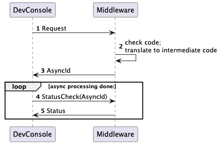
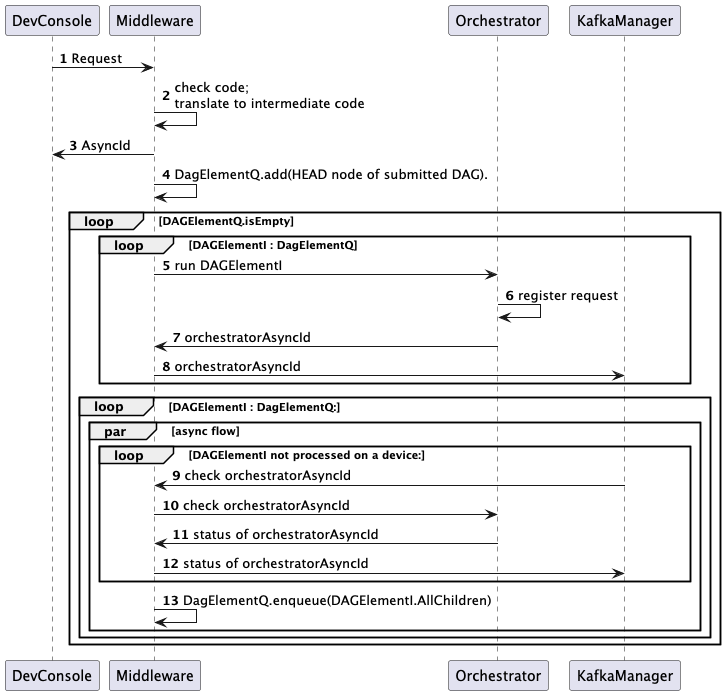
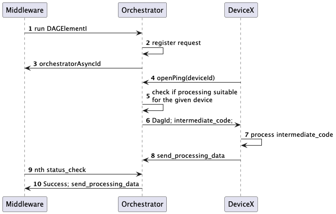

# Project Description:
This project aims to utilize the untapped computation power of digital devices. Any device that has a CPU which can do
basic arithmetic operations and can connect to the internet contribute to the computation power of the network.

## The inspiration behind this project:
Apollo guidance computer had a CPU which was only as powerful as a modern scientific calculator. Modern smartphones and
smart TVs are at-least million times more powerful than the Apollo guidance computer, and most of the time they are
idle. This project aims to utilize the idle computation power of these devices.

## What all devices can be supported on the network:
Any device which has a CPU that can do basic arithmetic operations and can connect to the internet can be added on the 
network. This includes smartphones, smart TVs, smart-watches, smart speakers, smart refrigerators, smart washing machines,
and so on. Currently, the network supports only Android devices, linux devices, Windows devices, and macOS devices.

## How is this different from BOINC:
BOINC is an amazing platform that allows users to donate their computation power to various scientific projects. However,
for adding a new kind of computation on the network, the project owner has to write a new client for the BOINC network, 
and the devices on the network that can contribute to the computation have to download and install the new client.

In this platform, for any new kind of computation, the project owner doesn't have to write a new client. The owner just
have to give the computation code in the `ramanujan` language. The platform would convert the code to an intermediate
code that the device can just run. The devices on the network don't have to download and install a new client for every
new kind of computation. They just have to download and install the `ramanujan` client one-time.

# Ramanujan Language:
### Variables:
Variables in `ramanujan` are declared using the `var` keyword. Like in most programming languages, the type of the
variable has to be explicitly given. Currently, the supported types are `integer`, `double`.

Example:
```
var x:integer;
var y:double;
```

### Arrays:
Arrays in `ramanujan` are declared using the `var` keyword. The size of the array has to be explicitly given. This is a
special kind of variable and the data type has to be given as `array`.

Example:
```
var arr[100]:array;
```

### Functions:
Functions in `ramanujan` are declared using the `def` keyword. The functions do not have any return type. The parameters
of the functions are both input and output. The parameters have to be declared with the `var` keyword. The parameters
are passed by reference.
To invoke a function, the `exec` keyword is used.

Example:
```
def add(var x:integer, var y:integer, var ans:integer) {
    ans = x + y;
}
exec add(1, 2, ans);
```
Here, the value of `x` is `1`, the value of `y` is `2`, and the value of `ans` NULL when passed to the function. But, since
the arguments are passed by reference, the value of `ans` is `3` after the function is executed.

### Loops:
`ramanujan` supports `while` loops. The syntax is similar to most programming languages.

Example:
```
var i:integer;
i = 0;
while(i < 10) {
    i = i + 1;
}
```

### If-Else:
`ramanujan` supports `if-else` statements. The syntax is similar to most programming languages.

Example:
```
var x:integer;
x = 10;
if(x < 10) {
    x = 0;
} else {
    x = 1;
}
```


### Distributing computation over multiple devices:
There are two methods in Ramanujan which need to be used to distribute the computation over multiple devices:
1. `threadStart`:
   The `threadStart` keyword is used to define a new thread. Any new variable can be introduced in the thread, or it
   can use the variables defined outside the thread. in global scope The thread can call any function defined in the code.
   Syntax:
    ```
    threadStart(t0) {
        // code
    }
    ```
    Here, `t0` is the name of the thread. The thread name has to be unique in the code.

   Example:
   ```
   threadStart(t0) {
       exec add(1, 2, ans);
   }
   ```

2. `threadOnEnd`:
   The `threadOnEnd` keyword is used to define actions that should be taken when one or more threads complete.
   Syntax:
    ```
    threadOnEnd(thread_seperated_thread_names, number_of_iterations) {
        // code
    }
    ```
   Example:
    ```
    threadOnEnd(t0, t1, 5) {
        // code
    }
    ```
    Here, `t0`, `t1` are the names of the threads. The last argument
    `5` is the number of iterations the threads have to run. The code defined in `threadOnEnd` for the n-1 times (here 4 times)
    would spawn the threads again. On the n-th time, the code defined in `threadOnEnd` would be executed.
   
            T1     T1   T1     T1     T1
         /    \  /  \  / \     / \     / \
       X       Y    Y      Y      Y       Z
         \    /  \   / \  /    \ /    \  /
            T0     T0   T0     T0     T0
   Here, In `Y` nodes, its just joining the thread and would do nothing, but on the last iteration, it would execute the code
    defined in `threadOnEnd` as node `Z`.

Example of complex threading:
```
      T2       T3
      / \    /   \
    N0   N1      N2
      \ /    \   /
      T1       T4
 ```
Following code would help here:
```
threadStart(t1) {
}
threadStart(t2) {
}
threadOnEnd(t1, t2, 1) {
   threadStart(t3) {
   }
    threadStart(t4) {
    }
}
threadOnEnd(t3, t4, 1) {
}
```

Example of a distributed gradient descent with Particle Swarm Optimization in `ramanujan` language:
```
def getSquared(var xPow:integer, var yPow:integer, var ans:integer) {
    if(xPow < yPow) {
        ans = yPow - xPow;
    } else {
        ans = xPow - yPow;
    }
}
def getAvg(var arr:array, var originalArr:array, var avgF:integer) {
  var index,ans1,tmpAvg1,tmpAvg2:integer;
    avgF = 0;
    index = 0;
    while(index < 100) {
        tmpAvg1 = arr[index];
        tmpAvg2 = originalArr[index];
        exec getSquared(tmpAvg1,tmpAvg2, ans1);
        avgF = avgF + ans1;
        index = index + 1;
    }
    avgF = avgF / 100;
}

def getTestArr(var xTest:integer, var yTest:integer, var testArrTest:array) {
    var it:integer;
    it = 0;
    while(it < 100) {
        testArrTest[it] = xTest * it + yTest;
        it = it + 1;
    }
}

var train[100]:array;
var i:integer;
i = 0;
while(i < 100) {
    train[i] = i * 1.9 + 33;
    i = i + 1;
}

def mainCode(var train : array, var x1:double, var y1:double) {
    var x1,y1,j,avg,diff1,diff2x,diff2y,tmp:double;
    j = 0;
    var testArr[100]:array;
    var slope:double;
    var nexty,nextx:double;
    testArr[1] = 1;
    while(j < 15000) {
        exec getTestArr(x1,y1,testArr);
        exec getAvg(testArr, train, diff1);

        tmp = x1 + 0.0001;
        exec getTestArr(tmp,y1,testArr);
        exec getAvg(testArr, train, diff2x);

        slope = (diff2x - diff1) / 0.0001;
        nextx = x1 - slope * 0.1;

        tmp = y1 + 0.0001;
        exec getTestArr(x1,tmp,testArr);
        exec getAvg(testArr, train, diff2y);

        slope = (diff2y - diff1) / 0.0001;
        nexty = y1 - slope * 0.50;

        x1 = nextx;
        y1 = nexty;

        j = j + 1;
    }
}

var x1[100][10],y1[100][10]:array;
x1[0][0] = 0;
y1[0][0] = 0;
var ansX1,ansy1 :double;
ansX1 = 0;
ansy1 = 0;
var iteration[10]:array;
i = 0;
while(i < 10) {
    iteration[i] = 0;
    i = i + 1;
}


def getBest(var train:array, var best:integer, var x1:array, var y1:array, var iteration:integer) {
    best = 0;
    var index:integer;
    var bestM:double;
    bestM = 1000000000;
    index = 0;
    while(index < 10) {
        var testArr[100]:array;
        testArr[0] = 0;
        var testX1,testY1:double;
        testX1 = x1[index][iteration];
        testY1 = y1[index][iteration];
        exec getTestArr(testX1,testY1,testArr);
        var avg:double;
        avg = 0;
        exec getAvg(testArr, train, avg);
        if(avg < bestM) {
            bestM = avg;
            best = index;
        }
        index = index + 1;
    }
  }


  def posRun(var thread:integer, var train:array, var x1:array, var y1:array, var iteration :array) {
    var currentIter:integer;
    currentIter = iteration[thread];
    if(currentIter == 0) {
  
      x1[thread][currentIter]=thread;
      y1[thread][currentIter]=thread;
    } else {
      var best :integer;
      best=0;
      var thisIter:integer;
      thisIter=currentIter;
      currentIter = currentIter-1;
      exec getBest(train, best, x1, y1, currentIter);
      if(x1[thread][currentIter] < x1[best][currentIter]) {
          x1[thread][thisIter] = x1[thread][currentIter]+(x1[best][currentIter]-x1[thread][currentIter])/2;
        } else {
          x1[thread][thisIter] = x1[thread][currentIter]-(x1[thread][currentIter]-x1[best][currentIter])/2;
      }
      if(y1[thread][currentIter] < y1[best][currentIter]) {
          y1[thread][thisIter] = y1[thread][currentIter]+(y1[best][currentIter]-y1[thread][currentIter])/2;
        } else {
          y1[thread][thisIter] = y1[thread][currentIter]-(y1[thread][currentIter]-y1[best][currentIter])/2;
      }
      currentIter=thisIter;
    }
  

    var x,y:double;
    x=x1[thread][currentIter];
    y=y1[thread][currentIter];
    exec mainCode(train, x, y);
    x1[thread][currentIter]=x;
    y1[thread][currentIter]=y;
  }

  threadStart(t0) {
    exec posRun(0, train, x1, y1,iteration);
    iteration[0]=iteration[0]+1;
  }
  
  threadStart(t1) {
    exec posRun(1, train, x1, y1,iteration);
    iteration[1]=iteration[1]+1;
  
  }
  threadStart(t2) {
    exec posRun(2, train, x1, y1,iteration);
    iteration[2]=iteration[2]+1;
  
  }
  threadStart(t3) {
    exec posRun(3, train, x1, y1,iteration);
    iteration[3]=iteration[3]+1;
  }
  threadStart(t4) {
    exec posRun(4, train, x1, y1,iteration);
    iteration[4]=iteration[4]+1;
  }
  threadStart(t5) {
    exec posRun(5, train, x1, y1,iteration);
    iteration[5]=iteration[5]+1;
  
  }
  threadStart(t6) {
    exec posRun(6, train, x1, y1,iteration);
    iteration[6]=iteration[6]+1;
  
  }
  threadStart(t7) {
    exec posRun(7, train, x1, y1,iteration);
    iteration[7]=iteration[7]+1;
  
  }
  threadStart(t8) {
    exec posRun(8, train, x1, y1,iteration);
    iteration[8]=iteration[8]+1;
  
  }
  threadStart(t9) {
    exec posRun(9, train, x1, y1,iteration);
    iteration[9]=iteration[9]+1;
  
  }
  
  threadOnEnd(t0,t1,t2,t3,t4,t5,t6,t7,t8,t9,5) {
    var best:integer;
    best=0;
    exec getBest(train, best, x1, y1, 4);
    ansX1=x1[best][4];
    ansy1=y1[best][4];
  }
```


## How fast is it from Python?:
The `ramanujan` language is faster than the Python3 language. The above single node code runs in ~350 ms. The same heuristic
in Python3 takes ~410 ms. The device it was tested on was a MacBook Air M3 : 8GB RAM, Apple M3 chip.


# Future of the language and platform:
Currently, the language's grammar and parsing logic is different from that of Python3. Since, Python3's ecosystem is huge,
and it is widely used in all the parallel processing tools like TensorFlow, PyTorch, etc., the  aim is that the python's code
can be run on the platform. To do that, the next version(near future), the syntax of the `ramanujan` language would be matching
the syntax of Python3. It should be able to take in all the python dependencies and run the code on the network.

## Near future works:
### On Language front:
1. Adopt Python's syntax and grammar.
2. Introduction of Object-Oriented-Programming in the language. The syntax to be exactly like Python3.
   1. This would need change on the interpreter (ramanujan-native) front as well.

### On Client front:
1. The client to be compiled on all usable OS. Starting with iOS.
    1. Client to be written for all other kind of smart-devices like smart refrigerators, smart washing machines, etc.
    2. It does not require any change on the interpreter front.

### On Platform front:
1. Currently, the platform can be deployed as a single node for a testing
2. For production use, the binaries as container can be up anywhere, but for the database and storage requirements, the
   platform is dependent on GCP services.
    1. In near future, the platform should be able to run on any kind of database / Storage services (Azure, AWS).

## Far Future works:
1. All the major ML Python libraries use CFFI to have core logic in C.
   1. The devices on platform should be able to use the C binaries. [not very far future]
      1. This would depend on the C code in these libs to be compiled for the devices. This is an additional effort to
         onboard a library on the platform.
   2. The platform should be able to consume the C code in the libraries, and the devices should be able to run the corresponding
      C code without an additional step of compilation. [far future]
2. Dependency registry for the libraries. All major functionalities as given by Maven, NPM, etc. should be available.

# Build and usage Strategy:
## Build:
Use `mvn clean install`. Following is the dependency hierarchy:
### Lower level dependencies:
1. commons
2. rule-engine
3. ramanujan-device-common
4. developer-console-model
5. monitoring-utils
6. db-layer

### Second level dependencies:
1. kafka-manager
2. orchestrator

### Third level dependencies:
1. middlware

### Fourth level dependencies:
1. developer-console

### Ramanujan-native:
```
cd ramanujan-native/native
mkdir build
cd build
cmake ..
cmake --build .
```

## Usage:
### Docker build:
Dockerfile is provided to containerize all the necessary services.

### Required APIs:
#### Middleware server:
1. PUT /orchestrator?ip=<orchestrator_ip>&port=<orchestrator_port>
2. PUT /kafka?ip=<kafka_manager_ip>&port=<kafka_manager_port>

#### Kafka Manager server:
1. PUT /middleware?ip=<middleware_ip>&port=<middleware_port>

#### For using experimental `prayog` device server on the network:
1. PUT /start?devices=<number_of_devices_to_emulate>

## Important configs:
### middleware:
1. orchestrator.host
2. orchestrator.port
3. kafka.host
4. kafka.port
5. db.type : "GCP", "IN_MEM"
6. storage.type : "GCP", "LOCAL"
7. monitoring.type : "GCP", "LOCAL"

### Orchestrator:
1. db.type : "GCP", "IN_MEM"
2. storage.type : "GCP", "LOCAL"
3. monitoring.type : "GCP", "LOCAL"

## Developer Console:
For executing code file:
```java -jar <developer-console-path>/target/developer-console-1.0-SNAPSHOT-fat.jar execute <path-to-code-file>```


# Code-Flow:


The code is submitted to DevConsole process which would be present in the path: `developer-console/target/developer-console-1.0-SNAPSHOT-fat.jar`.
The process would submit the code to the Middleware server, which would be responsible for converting the submitted code
to the intermediate code. The Middleware server would then work with the orchestrator server to process the required DAG.
Once the code gets converted to the intermediate code, the Middleware server would return back an asyncId which the
DevConsole would use to get the result of the code execution.



The Middleware server after creating the intermediate code, would start submitting the DAG-nodes to the orchestrator server.
Whenever a DAG-node gets processed, the Middleware server would submit children - DAG elements to the orchestrator server.
Once, the whole DAG is computed, the Middleware server sets the status of the whole processing as SUCCESS.

Pseudocode of the DAG computation is as follows:
```
DagElementQueue = new Queue();
DagElementQueue.add(rootDagElement);
isDone = false;
while(!isDone) {
   asyncTasks = []
   children = []
   while(DagElementQueue is not empty) {
       DagElement currentElement = DagElementQueue.poll();
       if(currentElement is not processed) {
           asyncTask = asyncCode(currentElement.process(), callback={
              if(currentElement has children) {
                  for(DagElement child : currentElement.children) {
                      children.add(child);
                  }
              }
           })
           asyncTasks.add(asyncTask);
       }
   }
    for(asyncTask : asyncTasks) {
         asyncTask.wait();
    }
    if(children is empty) {
        isDone = true;
    } else {
        for(DagElement child : children) {
            DagElementQueue.add(child);
        }
    }
}
```



Middleware end of the orchestrator:<br>
The Middleware server would submit a computation task to the Orchestrator server. The Orchestrator server would instantly
return back an asyncId that the Middleware server would use to get the result of the computation. The Orchestrator server
would then check for an available device, and will assign the computation task to the device.

Device end of the orchestrator:<br>
Any device-client that is available on the Ramanujan platform, would keep pinging to the Orchestrator server. Currently,
the pings contains the deviceId, but in future it would send in the device-stats as well. The Orchestrator server would
keep track of the devices that are available on the network. On the ping API request, the Orchestrator server would return
back a suitable computation task mapped to the device. The device would then execute the task and return back the result to the
Orchestrator server.


#### Use of Kafka-Manager:
This service helps the system to resume in case the Middleware server goes down. This server becomes a part of a PubSub system.
It can be part of Apache-Kafka, GCP-PubSub, and a local PubSub system. The producers and consumer in the server code can
be extended to use any of the PubSub systems.

In addition to this, the Middleware servers are stateless and do not have the track of the asyncIds. The Kafka-Manager server keeps the track
of the asyncIds. The messages on the PubSub queue contains the asyncId and the status of the computation. The consumer of
the Kafka-Manager server would ping the Middleware server with the asyncId to get the result of the computation. This helps
the Middleware server to move forward with the DAG computation.


