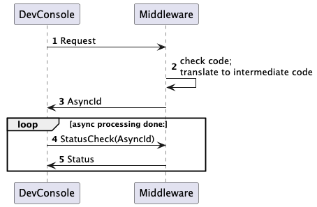
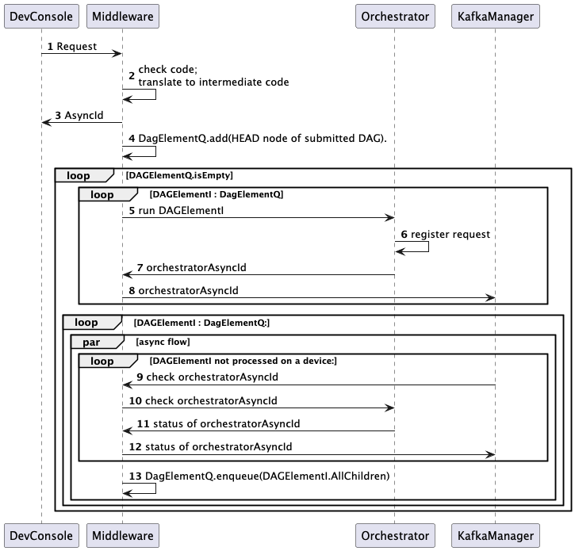
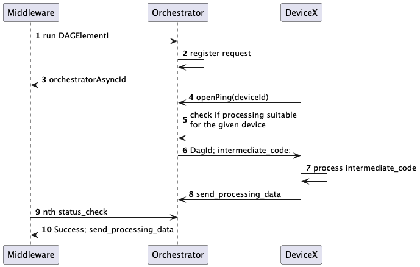
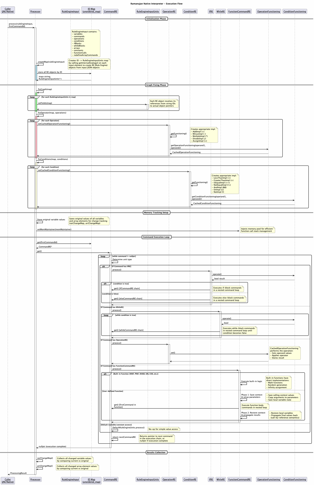

# Project Description:
This project aims to utilize the untapped computation power of digital devices. Any device that has a CPU which can do
basic arithmetic operations and can connect to the internet contribute to the computation power of the network.

## The inspiration behind this project:
Apollo guidance computer had a CPU which was only as powerful as a modern scientific calculator. Modern smartphones and
smart TVs are at-least million times more powerful than the Apollo guidance computer, and most of the time they are
idle. This project aims to utilize the idle computation power of these devices.

## What all devices can be supported on the network:
Any device which has a CPU that can do basic arithmetic operations and can connect to the internet can be added on the 
network. This includes smartphones, smart TVs, smart-watches, smart speakers, smart refrigerators, smart washing machines,
and so on. Currently, the network supports only Android devices, linux devices, Windows devices, and macOS devices.

## How is this different from BOINC:
BOINC is an amazing platform that allows users to donate their computation power to various scientific projects. However,
for adding a new kind of computation on the network, the project owner has to write a new client for the BOINC network, 
and the devices on the network that can contribute to the computation have to download and install the new client.

In this platform, for any new kind of computation, the project owner doesn't have to write a new client. The owner just
have to give the computation code in the `ramanujan` language. The platform would convert the code to an intermediate
code that the device can just run. The devices on the network don't have to download and install a new client for every
new kind of computation. They just have to download and install the `ramanujan` client one-time.

# Ramanujan Language:
### Variables:
Variables in `ramanujan` are declared using the `var` keyword. Like in most programming languages, the type of the
variable has to be explicitly given. Currently, the supported types are `integer`, `double`.

Example:
```
var x:integer;
var y:double;
```

### Arrays:
Arrays in `ramanujan` are declared using the `var` keyword. The size of the array be both variable and explicitly given. This is a special kind of variable and the data type has to be given as `array`.

Example:
```
var arr[100]:array;
var n : double;
n =10;
var arr1[n]: array
```

### Functions:
Functions in `ramanujan` are declared using the `def` keyword. The functions do not have any return type. The parameters
of the functions are both input and output. The parameters have to be declared with the `var` keyword. The parameters
are passed by reference.
To invoke a function, the `exec` keyword is used.

Example:
```
def add(var x:integer, var y:integer, var ans:integer) {
    ans = x + y;
}
exec add(1, 2, ans);
```
Here, the value of `x` is `1`, the value of `y` is `2`, and the value of `ans` NULL when passed to the function. But, since
the arguments are passed by reference, the value of `ans` is `3` after the function is executed.

### Loops:
`ramanujan` supports `while` loops. The syntax is similar to most programming languages.

Example:
```
var i:integer;
i = 0;
while(i < 10) {
    i = i + 1;
}
```

### If-Else:
`ramanujan` supports `if-else` statements. The syntax is similar to most programming languages.

Example:
```
var x:integer;
x = 10;
if(x < 10) {
    x = 0;
} else {
    x = 1;
}
```


### Distributing computation over multiple devices:
There are two methods in Ramanujan which need to be used to distribute the computation over multiple devices:
1. `threadStart`:
   The `threadStart` keyword is used to define a new thread. Any new variable can be introduced in the thread, or it
   can use the variables defined outside the thread. in global scope The thread can call any function defined in the code.
   Syntax:
    ```
    threadStart(t0) {
        // code
    }
    ```
    Here, `t0` is the name of the thread. The thread name has to be unique in the code.

   Example:
   ```
   threadStart(t0) {
       exec add(1, 2, ans);
   }
   ```

2. `threadOnEnd`:
   The `threadOnEnd` keyword is used to define actions that should be taken when one or more threads complete.
   The body code executes **only on the last iteration**.
   Syntax:
    ```
    threadOnEnd(thread_seperated_thread_names, number_of_iterations) {
        // code
    }
    ```
   Example:
    ```
    threadOnEnd(t0, t1, 5) {
        // code
    }
    ```
    Here, `t0`, `t1` are the names of the threads. The last argument
    `5` is the number of iterations the threads have to run. The code defined in `threadOnEnd` for the n-1 times (here 4 times)
    would spawn the threads again. On the n-th time, the code defined in `threadOnEnd` would be executed.
   
            T1     T1   T1     T1     T1
         /    \  /  \  / \     / \     / \
       X       Y    Y      Y      Y       Z
         \    /  \   / \  /    \ /    \  /
            T0     T0   T0     T0     T0
   Here, In `Y` nodes, its just joining the thread and would do nothing, but on the last iteration, it would execute the code
    defined in `threadOnEnd` as node `Z`.

3. `threadParallelismCycle`:
   The `threadParallelismCycle` keyword is used to define actions that should be taken **after every cycle** of parallelism.
   Unlike `threadOnEnd`, which only executes its body on the final iteration, `threadParallelismCycle` executes its body
   after **each and every** completed cycle (including the last one).
   Syntax:
    ```
    threadParallelismCycle(thread_names, number_of_iterations) {
        // code – runs after every cycle
    }
    ```
   Example:
    ```
    threadParallelismCycle(t0, t1, 5) {
        // this block runs after each of the 5 cycles
    }
    ```

   The DAG structure for `threadParallelismCycle(t0, t1, 3) { body }`:
   ```
       T0      T0      T0
     /    \  /    \  /    \
   X    body   body   body   (final)
     \    /  \    /  \    /
       T1      T1      T1
   ```
   Each `body` node runs after every pair of T0+T1 threads completes. After each body (except the last), the threads
   are re-spawned for the next cycle.

   > **Important**: Do **not** combine `threadParallelismCycle` and `threadOnEnd` on the **same** thread set.
   > `threadParallelismCycle` already runs its body after the final cycle too, so `threadOnEnd` is
   > redundant. When added on the same threads, `threadOnEnd` injects an extra empty join node as a
   > second successor of every first-cycle thread (instead of the expected single cycle-body successor),
   > and overwrites the internal re-spawn map entries that `threadParallelismCycle` set up. This breaks
   > the cycle chain and creates an unintended parallel execution path.
   >
   > If you want a dedicated block that only runs after the **last** cycle, use `threadOnEnd` alone
   > (without `threadParallelismCycle`). If you want code that runs after **every** cycle (including the
   > last), use `threadParallelismCycle` alone.

Example of complex threading:
```
      T2       T3
      / \    /   \
    N0   N1      N2
      \ /    \   /
      T1       T4
 ```
Following code would help here:
```
threadStart(t1) {
}
threadStart(t2) {
}
threadOnEnd(t1, t2, 1) {
   threadStart(t3) {
   }
    threadStart(t4) {
    }
}
threadOnEnd(t3, t4, 1) {
}
```

Example of a distributed gradient descent with Particle Swarm Optimization in `ramanujan` language:
```
def getSquared(var xPow:integer, var yPow:integer, var ans:integer) {
    if(xPow < yPow) {
        ans = yPow - xPow;
    } else {
        ans = xPow - yPow;
    }
}
def getAvg(var arr:array, var originalArr:array, var avgF:integer) {
  var index,ans1,tmpAvg1,tmpAvg2:integer;
    avgF = 0;
    index = 0;
    while(index < 100) {
        tmpAvg1 = arr[index];
        tmpAvg2 = originalArr[index];
        exec getSquared(tmpAvg1,tmpAvg2, ans1);
        avgF = avgF + ans1;
        index = index + 1;
    }
    avgF = avgF / 100;
}

def getTestArr(var xTest:integer, var yTest:integer, var testArrTest:array) {
    var it:integer;
    it = 0;
    while(it < 100) {
        testArrTest[it] = xTest * it + yTest;
        it = it + 1;
    }
}

var train[100]:array;
var i:integer;
i = 0;
while(i < 100) {
    train[i] = i * 1.9 + 33;
    i = i + 1;
}

def mainCode(var train : array, var x1:double, var y1:double) {
    var x1,y1,j,avg,diff1,diff2x,diff2y,tmp:double;
    j = 0;
    var testArr[100]:array;
    var slope:double;
    var nexty,nextx:double;
    testArr[1] = 1;
    while(j < 15000) {
        exec getTestArr(x1,y1,testArr);
        exec getAvg(testArr, train, diff1);

        tmp = x1 + 0.0001;
        exec getTestArr(tmp,y1,testArr);
        exec getAvg(testArr, train, diff2x);

        slope = (diff2x - diff1) / 0.0001;
        nextx = x1 - slope * 0.1;

        tmp = y1 + 0.0001;
        exec getTestArr(x1,tmp,testArr);
        exec getAvg(testArr, train, diff2y);

        slope = (diff2y - diff1) / 0.0001;
        nexty = y1 - slope * 0.50;

        x1 = nextx;
        y1 = nexty;

        j = j + 1;
    }
}

var x1[100][10],y1[100][10]:array;
x1[0][0] = 0;
y1[0][0] = 0;
var ansX1,ansy1 :double;
ansX1 = 0;
ansy1 = 0;
var iteration[10]:array;
i = 0;
while(i < 10) {
    iteration[i] = 0;
    i = i + 1;
}


def getBest(var train:array, var best:integer, var x1:array, var y1:array, var iteration:integer) {
    best = 0;
    var index:integer;
    var bestM:double;
    bestM = 1000000000;
    index = 0;
    while(index < 10) {
        var testArr[100]:array;
        testArr[0] = 0;
        var testX1,testY1:double;
        testX1 = x1[index][iteration];
        testY1 = y1[index][iteration];
        exec getTestArr(testX1,testY1,testArr);
        var avg:double;
        avg = 0;
        exec getAvg(testArr, train, avg);
        if(avg < bestM) {
            bestM = avg;
            best = index;
        }
        index = index + 1;
    }
  }


  def posRun(var thread:integer, var train:array, var x1:array, var y1:array, var iteration :array) {
    var currentIter:integer;
    currentIter = iteration[thread];
    if(currentIter == 0) {
  
      x1[thread][currentIter]=thread;
      y1[thread][currentIter]=thread;
    } else {
      var best :integer;
      best=0;
      var thisIter:integer;
      thisIter=currentIter;
      currentIter = currentIter-1;
      exec getBest(train, best, x1, y1, currentIter);
      if(x1[thread][currentIter] < x1[best][currentIter]) {
          x1[thread][thisIter] = x1[thread][currentIter]+(x1[best][currentIter]-x1[thread][currentIter])/2;
        } else {
          x1[thread][thisIter] = x1[thread][currentIter]-(x1[thread][currentIter]-x1[best][currentIter])/2;
      }
      if(y1[thread][currentIter] < y1[best][currentIter]) {
          y1[thread][thisIter] = y1[thread][currentIter]+(y1[best][currentIter]-y1[thread][currentIter])/2;
        } else {
          y1[thread][thisIter] = y1[thread][currentIter]-(y1[thread][currentIter]-y1[best][currentIter])/2;
      }
      currentIter=thisIter;
    }
  

    var x,y:double;
    x=x1[thread][currentIter];
    y=y1[thread][currentIter];
    exec mainCode(train, x, y);
    x1[thread][currentIter]=x;
    y1[thread][currentIter]=y;
  }

  threadStart(t0) {
    exec posRun(0, train, x1, y1,iteration);
    iteration[0]=iteration[0]+1;
  }
  
  threadStart(t1) {
    exec posRun(1, train, x1, y1,iteration);
    iteration[1]=iteration[1]+1;
  
  }
  threadStart(t2) {
    exec posRun(2, train, x1, y1,iteration);
    iteration[2]=iteration[2]+1;
  
  }
  threadStart(t3) {
    exec posRun(3, train, x1, y1,iteration);
    iteration[3]=iteration[3]+1;
  }
  threadStart(t4) {
    exec posRun(4, train, x1, y1,iteration);
    iteration[4]=iteration[4]+1;
  }
  threadStart(t5) {
    exec posRun(5, train, x1, y1,iteration);
    iteration[5]=iteration[5]+1;
  
  }
  threadStart(t6) {
    exec posRun(6, train, x1, y1,iteration);
    iteration[6]=iteration[6]+1;
  
  }
  threadStart(t7) {
    exec posRun(7, train, x1, y1,iteration);
    iteration[7]=iteration[7]+1;
  
  }
  threadStart(t8) {
    exec posRun(8, train, x1, y1,iteration);
    iteration[8]=iteration[8]+1;
  
  }
  threadStart(t9) {
    exec posRun(9, train, x1, y1,iteration);
    iteration[9]=iteration[9]+1;
  
  }
  
  threadOnEnd(t0,t1,t2,t3,t4,t5,t6,t7,t8,t9,5) {
    var best:integer;
    best=0;
    exec getBest(train, best, x1, y1, 4);
    ansX1=x1[best][4];
    ansy1=y1[best][4];
  }
```


## How fast is it from Python?:
The `ramanujan` language is faster than the Python3 language. The above single node code runs in ~350 ms. The same heuristic
in Python3 takes ~410 ms. The device it was tested on was a MacBook Air M3 : 8GB RAM, Apple M3 chip.


# Python Support (In Development):
Ramanujan now supports a subset of Python syntax. Python code is converted to Ramanujan's intermediate representation using Python's AST module.

## How Python Code is Processed:

The conversion from Python code to Ramanujan's intermediate code follows this flow:

```
Python Source Code (.py file)
        ↓
    [PythonAstInvoker]
    Writes code to temp file, invokes: python3 -c "import ast, ast2json, json; ..."
        ↓
    Python's ast.parse() generates AST
        ↓
    ast2json.ast2json() converts AST to JSON
        ↓
    JSON string returned to Java
        ↓
    [JsonAstParser]
    Parses JSON into Java AST node objects (ModuleNode, AssignNode, IfNode, etc.)
        ↓
    [PythonAstToRuleEngineInputConverter]
    Traverses AST nodes and generates RuleEngineInput structures
    (Variables, Operations, Commands, Conditions, etc.)
        ↓
    RuleEngineInput (Ramanujan Intermediate Code)
        ↓
    Execution by Ramanujan Engine
```

### Technical Details:
1. **PythonAstInvoker**: Creates a temporary `.py` file, then runs a Python snippet that:
   - Imports `ast`, `ast2json`, and `json`
   - Parses the code using `ast.parse()`
   - Converts to JSON using `ast2json.ast2json()`
   - Outputs JSON to stdout

2. **JsonAstParser**: Uses Jackson to parse the JSON and creates corresponding Java AST node objects.

3. **PythonAstToRuleEngineInputConverter**: Walks the AST tree and generates:
   - `Variable` objects for variable declarations
   - `Array` objects for list/array declarations  
   - `Operation` objects for arithmetic and assignments
   - `Condition` objects for comparisons
   - `Command` objects that link everything in execution order
   - `If`/`While` blocks for control flow
   - `FunctionCall` objects for function invocations

## Supported Python Features:

### Variables and Types
Variables are automatically declared on first assignment. Type is inferred from the assigned value:
- **Integer**: `x = 5`
- **Double/Float**: `y = 3.14` or any arithmetic operation result

```python
x = 5           # Integer
y = 3.14        # Double
z = x + y       # Double (arithmetic result)
```

### Arrays
Arrays **must** be created using list comprehensions initialized with `0`. This is the only supported form:
```python
# 1D array initialized with zeros
arr = [0 for _ in range(100)]

# 2D array (matrix)
matrix = [[0 for _ in range(10)] for _ in range(10)]

# n-dimensional arrays with nested comprehensions
tensor = [[[0 for _ in range(5)] for _ in range(10)] for _ in range(3)]

# Variable dimensions are supported
n = 100
arr = [0 for _ in range(n)]

# Array element access and assignment
arr[0] = 10
value = arr[i]
matrix[x][y] = 5
```

**Note**: Arrays cannot be initialized with explicit values like `[1, 2, 3]` - only `[0 for _ in range(n)]` form is allowed.

### Arithmetic Operations
Supported operators: `+`, `-`, `*`, `/`
```python
result = a + b * c - d / e
```

### Augmented Assignments
```python
x += 5      # x = x + 5
y -= 3      # y = y - 3
z *= 2      # z = z * 2
w /= 4      # w = w / 4
```

### Comparison Operations
Supported: `<`, `<=`, `>`, `>=`, `==`, `!=`
```python
if x > 5:
    pass
while count <= 100:
    pass
```

### Control Flow

#### If-Else Statements
```python
if x > 10:
    y = 1
else:
    y = 0
```

**Note**: `elif` is not supported. Use nested if-else instead:
```python
# Instead of elif, use nested if-else:
if x > 10:
    y = 1
else:
    if x > 5:
        y = 2
    else:
        y = 0
```

#### While Loops
```python
i = 0
while i < 100:
    # loop body
    i += 1
```

### Functions
Functions are defined using `def` and called directly. Arguments are passed by reference.

```python
def calculate(a, b, result):
    result = a + b * 2

# Function call
calculate(x, y, answer)
```

### Return Values
Functions can return values using tuple unpacking:
```python
def get_coords():
    x = 10
    y = 20
    return x, y

# Tuple unpacking to receive return values
a, b = get_coords()
```

Single return values:
```python
def compute(x):
    result = x * 2
    return result

value = compute(5)
```

## Unsupported Python Features (Current Limitations):

### 1. Return with Array Element Access
Returning an array element directly is **NOT** supported:
```python
# NOT SUPPORTED
def get_element(arr, index):
    return arr[index]  # ❌ Cannot return array element directly
```
**Workaround**: Assign to a variable first, then return:
```python
# SUPPORTED
def get_element(arr, index):
    value = arr[index]
    return value  # ✓ Return variable works
```

### 2. Function Call as Argument
Passing a function call as an argument to another function is **NOT** supported:
```python
# NOT SUPPORTED
result = outer_func(inner_func(x))  # ❌ Nested function calls not allowed
```
**Workaround**: Use intermediate variables:
```python
# SUPPORTED
temp = inner_func(x)
result = outer_func(temp)  # ✓ Works with intermediate variable
```

### 3. Return Function Call
Returning the result of a function call directly is **NOT** supported:
```python
# NOT SUPPORTED
def wrapper(x):
    return compute(x)  # ❌ Cannot return function call directly
```
**Workaround**: Assign to a variable first:
```python
# SUPPORTED
def wrapper(x):
    result = compute(x)
    return result  # ✓ Return variable works
```

### 4. Complex Function References
Only simple function names are supported (no method chains or computed function references):
```python
# NOT SUPPORTED
obj.method()           # ❌ Method calls on objects
funcs[0]()             # ❌ Function from array
getattr(obj, 'func')() # ❌ Dynamic function access
```

### 5. For Loops
`for` loops are **NOT** currently supported. Use `while` loops instead:
```python
# NOT SUPPORTED
for i in range(10):  # ❌
    pass

# SUPPORTED - Use while loop
i = 0
while i < 10:  # ✓
    i += 1
```

### 6. Classes and Objects
Object-oriented programming is not yet supported:
```python
# NOT SUPPORTED
class MyClass:  # ❌
    pass
```

### 7. Boolean Operations in Conditions
Boolean expressions with `and`/`or`/`not` are **NOT** supported:
```python
# NOT SUPPORTED
if x > 5 and y < 10:  # ❌
    pass
if not flag:          # ❌
    pass
```
**Workaround**: Use nested if statements:
```python
# SUPPORTED
if x > 5:
    if y < 10:  # ✓ Nested if for 'and' logic
        pass
```

### 8. List Operations
Dynamic list operations are not supported:
```python
# NOT SUPPORTED
arr.append(5)   # ❌ append
arr.pop()       # ❌ pop
len(arr)        # ❌ len function
arr + other     # ❌ list concatenation
```

### 9. Strings
Strings are **NOT** supported:
```python
# NOT SUPPORTED
s = "hello"            # ❌ string assignment
s = "hello" + "world"  # ❌ string concatenation
```

### 10. Import Statements
Importing modules is not supported:
```python
# NOT SUPPORTED
import math  # ❌
from collections import deque  # ❌
```

### 11. Exception Handling
Try-except blocks are not supported:
```python
# NOT SUPPORTED
try:  # ❌
    pass
except:
    pass
```

### 12. Generators and Iterators
Generator expressions and iterator protocols are not supported.

### 13. Power and Modulo Operators
Power (`**`) and modulo (`%`) operators are **NOT** currently supported:
```python
# NOT SUPPORTED
x = 2 ** 10    # ❌ power operator
y = n % 10     # ❌ modulo operator
```

### 14. elif Keyword
The `elif` keyword is **NOT** supported. Use nested if-else:
```python
# NOT SUPPORTED
if x > 10:
    y = 1
elif x > 5:    # ❌ elif not allowed
    y = 2

# SUPPORTED - Use nested if-else
if x > 10:
    y = 1
else:
    if x > 5:  # ✓
        y = 2
```

## Complete Python Example:
```python
# Gradient descent example in Python syntax

def get_squared(x_pow, y_pow):
    if x_pow < y_pow:
        ans = y_pow - x_pow
    else:
        ans = x_pow - y_pow
    return ans

def get_test_arr(x, y, test_arr):
    it = 0
    while it < 100:
        test_arr[it] = x * it + y
        it = it + 1

# Initialize training data
train = [0 for _ in range(100)]
i = 0
while i < 100:
    train[i] = i * 1.9 + 33
    i = i + 1

# Main computation
x1 = 0.0
y1 = 0.0
j = 0
test_arr = [0 for _ in range(100)]

while j < 1000:
    get_test_arr(x1, y1, test_arr)
    # ... gradient computation logic
    j = j + 1
```


# GPU Acceleration Support (OpenCL):

Ramanujan supports offloading compute-intensive work to the GPU via OpenCL. Any Python function
whose name matches the pattern `funcName_GPU_N` (where `N` is a positive integer) is automatically
compiled to an OpenCL C kernel during translation and dispatched to the GPU at runtime.

## Writing a GPU function

The function name encodes the number of NDRange dimensions:

```python
def funcName_GPU_N(dataArg1, dataArg2, ..., dataArgK, rangeDim1, ..., rangeDimN):
    # body – use rangeDimK as the per-work-item index
```

| Part | Role | What the translator does |
|---|---|---|
| `N` in `_GPU_N` | Number of NDRange dimensions (`work_dim`) | Read from the function name; no extra argument needed |
| `dataArg1 … dataArgK` | Data arrays (first `total_params − N` parameters) | Emitted as `__global float*` kernel parameters |
| `rangeDim1 … rangeDimN` | Work-item index variables (last `N` parameters) | Emitted as `int dim = get_global_id(K);` declarations; their **call-site values** become `global_work_size[]` for `clEnqueueNDRangeKernel` |

> **Requirement:** Data args must be arrays. The translator maps them to OpenCL buffers.

## Examples

### 1-D vector addition
```python
def vector_add_GPU_1(a, b, c, gid):
    c[gid] = a[gid] + b[gid]

# 1024-element arrays, 1 NDRange dimension
vector_add_GPU_1(a, b, c, 1024)
```
Generated OpenCL kernel:
```c
__kernel void vector_add(__global float* a, __global float* b, __global float* c) {
    int gid = get_global_id(0);
    c[gid] = (a[gid] + b[gid]);
}
```

### 2-D matrix kernel
```python
def matrix_add_GPU_2(a, b, c, row, col):
    c[row] = a[row] + b[col]

# 64 × 64 grid (2 NDRange dimensions)
matrix_add_GPU_2(a, b, c, 64, 64)
```

### Control flow inside a GPU function
`if/else` and `while` inside the function body are translated to their C equivalents:
```python
def relu_GPU_1(a, out, gid):
    if a[gid] > 0:
        out[gid] = a[gid]
    else:
        out[gid] = 0

relu_GPU_1(a, out, 512)
```

### Calling helper (device) functions from a GPU kernel

A GPU kernel can call ordinary (non-`_GPU_N`) Python functions that are defined in the same file.
The translator converts those helpers to OpenCL C **device functions** and prepends them before the
`__kernel` declaration so they are visible to the kernel body.

```python
# Plain Python helper – becomes a float device function in the generated OpenCL C
def scale2(x):
    r = x * 2
    return r

# GPU kernel – calls the helper for every work-item
def apply_scale_GPU_1(a, out, gid):
    v = a[gid]          # load array element into a local variable first
    out[gid] = scale2(v)

apply_scale_GPU_1(a, out, 1024)
```

Generated OpenCL C:
```c
float scale2(float x) {
    float r = (x * 2);
    return r;
}

__kernel void apply_scale(__global float* a, __global float* out) {
    int gid = get_global_id(0);
    float v = a[gid];
    out[gid] = scale2(v);
}
```

#### Helper function constraints

| Constraint | Detail |
|---|---|
| **Parameter types** | All helper parameters are treated as `float` scalars. Array pointers (`__global float*`) are **not** supported in helper functions. |
| **Return type** | Always `float`. |
| **No subscript as argument** | Array element expressions (`a[i]`) cannot be passed directly as arguments to a helper call. Assign the element to a local variable first: `v = a[gid]; out[gid] = scale2(v)`. |
| **No recursion** | A function may not call itself. The translator throws a `CompilationException` if a recursive call is detected at translation time. |
| **No GPU–kernel calls** | A helper (or the kernel) may not call another `_GPU_N` function. GPU kernels are dispatched via `clEnqueueNDRangeKernel` and cannot be invoked as device functions. |
| **Scope** | Only top-level module functions are eligible as helpers. Nested function definitions are not supported. |

#### Recursion guard

The translator enforces the no-recursion rule at **translation time**, not at runtime:

```python
# INVALID – will raise CompilationException during translation
def bad_GPU_1(a, gid):
    a[gid] = bad_GPU_1(a, gid)   # ❌ recursive GPU call

# INVALID – helper self-recursion is also rejected
def factorial(n):
    return n * factorial(n - 1)  # ❌ recursive helper

def kernel_GPU_1(a, gid):
    a[gid] = factorial(a[gid])
```

## Build prerequisites

| Platform | Requirement |
|---|---|
| macOS | OpenCL is part of the system framework – no extra install needed |
| Linux | `sudo apt install ocl-icd-opencl-dev opencl-headers` |
| Windows | Install GPU vendor drivers: NVIDIA CUDA Toolkit, AMD ROCm, or Intel OpenCL SDK |

## Runtime behaviour
- The OpenCL platform and device are initialised **once** on the first GPU call and reused for all subsequent calls.
- A GPU device is preferred; if none is available the runtime falls back to any OpenCL device (e.g., a CPU implementation).
- Each unique kernel source is **compiled and cached** on first invocation; repeated calls to the same GPU function reuse the cached `cl_kernel`.
- Data is staged `double → float` before upload and `float → double` after read-back (OpenCL kernels operate on `float`).
- If OpenCL initialisation fails at runtime a diagnostic is printed to `stderr` and execution returns immediately.
- The `GPU_ENABLED` macro must be set at compile time (via `-DENABLE_GPU=ON`). Builds without it contain **no OpenCL code** and have no OpenCL runtime dependency.

# Future of the language and platform:
Ramanujan now supports a subset of Python syntax through AST-based conversion (see Python Support section above). The platform is actively evolving to support more Python features progressively.

## Python Feature Roadmap:
Python support is being actively developed on the Ramanujan platform. More and more features are being added continuously to bring the full power of Python to distributed computing:

1. **Coming Shortly**: Object-Oriented Programming (OOP) support
   - Classes and objects
   - Inheritance and polymorphism
   - Methods and properties

2. **Progressive Additions**: We will progressively add all Python features to the Ramanujan platform, including:
   - Boolean operations (`and`, `or`, `not`)
   - Power (`**`) and modulo (`%`) operators
   - `for` loops and iterators
   - `elif` statements
   - String operations
   - Exception handling (`try`/`except`)
   - Import statements and module system
   - List operations (append, pop, etc.)
   - Function call composition and nested expressions

3. **Long-term Vision**: Full Python3 ecosystem compatibility
   - Support for Python dependencies and libraries
   - Integration with TensorFlow, PyTorch, NumPy, and other scientific computing libraries
   - CFFI and C extension support for high-performance libraries

The goal is to make Python code seamlessly executable on the distributed Ramanujan platform while maintaining performance and enabling parallel computation across devices.

## Near future works:
### On Client front:
1. The client to be compiled on all usable OS. Starting with iOS.
    1. Client to be written for all other kind of smart-devices like smart refrigerators, smart washing machines, etc.
    2. It does not require any change on the interpreter front.

### On Platform front:
1. Currently, the platform can be deployed as a single node for a testing
2. For production use, the binaries as container can be up anywhere, but for the database and storage requirements, the
   platform is dependent on GCP services.
    1. In near future, the platform should be able to run on any kind of database / Storage services (Azure, AWS).

## Far Future works:
1. All the major ML Python libraries use CFFI to have core logic in C.
   1. The devices on platform should be able to use the C binaries. [not very far future]
      1. This would depend on the C code in these libs to be compiled for the devices. This is an additional effort to
         onboard a library on the platform.
   2. The platform should be able to consume the C code in the libraries, and the devices should be able to run the corresponding
      C code without an additional step of compilation. [far future]
2. Dependency registry for the libraries. All major functionalities as given by Maven, NPM, etc. should be available.

# Build and usage Strategy:
## Build:
Use `mvn clean install`. Following is the dependency hierarchy:
### Lower level dependencies:
1. commons
2. rule-engine
3. ramanujan-device-common
4. developer-console-model
5. monitoring-utils
6. db-layer

### Second level dependencies:
1. kafka-manager
2. orchestrator

### Third level dependencies:
1. middlware

### Fourth level dependencies:
1. developer-console

### Ramanujan-native:
```
cd ramanujan-native/native
mkdir build
cd build
cmake ..
cmake --build .
```

#### Ramanujan-native with GPU support (OpenCL):
```
cd ramanujan-native/native
mkdir build-gpu
cd build-gpu
cmake -DENABLE_GPU=ON ..
cmake --build .
```
Passing `-DENABLE_GPU=ON` sets the `GPU_ENABLED` preprocessor macro, links OpenCL, and activates
OpenCL kernel dispatch for `_GPU`-suffixed functions. Standard builds (`-DENABLE_GPU=OFF`, the
default) compile no OpenCL code and have no dependency on any OpenCL runtime.
### Docker build:
Dockerfile is provided to containerize all the necessary services.

### Required APIs:
#### Middleware server:
1. PUT /orchestrator?ip=<orchestrator_ip>&port=<orchestrator_port>
2. PUT /kafka?ip=<kafka_manager_ip>&port=<kafka_manager_port>

#### Kafka Manager server:
1. PUT /middleware?ip=<middleware_ip>&port=<middleware_port>

#### For using experimental `prayog` device server on the network:
1. PUT /start?devices=<number_of_devices_to_emulate>

## Important configs:
### middleware:
1. orchestrator.host
2. orchestrator.port
3. kafka.host
4. kafka.port
5. db.type : "GCP", "IN_MEM"
6. storage.type : "GCP", "LOCAL"
7. monitoring.type : "GCP", "LOCAL"

### Orchestrator:
1. db.type : "GCP", "IN_MEM"
2. storage.type : "GCP", "LOCAL"
3. monitoring.type : "GCP", "LOCAL"

## Developer Console:
For executing code file:
```java -jar <developer-console-path>/target/developer-console-1.0-SNAPSHOT-fat.jar execute <path-to-code-file>```

## Python Dependencies for Translation Module

The translation module (middleware-translation) currently requires the following Python dependencies to convert Python code to Ramanujan intermediate code:

- **Python 3.x**: Required for AST generation [In particular >= 3.12]
- **ast2json** _(may be removed in future versions)_: BSD-licensed library for converting Python AST to JSON format
  - Install: `pip install ast2json`
  - Repository: https://github.com/YoloSwagTeam/ast2json
  - License: BSD-3-Clause

For more information about third-party licenses, see [THIRD_PARTY_LICENSES.md](THIRD_PARTY_LICENSES.md).

## Installing Ramanujan Console for executing on-current-device (Ubuntu & macOS)

To set up the Ramanujan developer console and required dependencies, run the provided installer script:

```sh
# Make the installer executable
chmod +x install_ramanujan.sh

# Run the installer
./install_ramanujan.sh
```

- The script will prompt you for a workspace path and set the `RAMANUJAN_WS` environment variable.
- It will download the latest developer console JAR to your workspace.
- It will check for and install `libjsoncpp` if needed.
- It will add an alias `rj` to your shell profile for easy usage.

**After installation, restart your terminal or run:**

```sh
source ~/.zshrc   # or ~/.bashrc, ~/.bash_profile, depending on your shell
```

You can now run the developer console with:

```sh
rj <path-to-code-file>
```

# Code-Flow:


The code is submitted to DevConsole process which would be present in the path: `developer-console/target/developer-console-1.0-SNAPSHOT-fat.jar`.
The process would submit the code to the Middleware server, which would be responsible for converting the submitted code
to the intermediate code. The Middleware server would then work with the orchestrator server to process the required DAG.
Once the code gets converted to the intermediate code, the Middleware server would return back an asyncId which the
DevConsole would use to get the result of the code execution.



The Middleware server after creating the intermediate code, would start submitting the DAG-nodes to the orchestrator server.
Whenever a DAG-node gets processed, the Middleware server would submit children - DAG elements to the orchestrator server.
Once, the whole DAG is computed, the Middleware server sets the status of the whole processing as SUCCESS.

Pseudocode of the DAG computation is as follows:
```
DagElementQueue = new Queue();
DagElementQueue.add(rootDagElement);
isDone = false;
while(!isDone) {
   asyncTasks = []
   children = []
   while(DagElementQueue is not empty) {
       DagElement currentElement = DagElementQueue.poll();
       if(currentElement is not processed) {
           asyncTask = asyncCode(currentElement.process(), callback={
              if(currentElement has children) {
                  for(DagElement child : currentElement.children) {
                      children.add(child);
                  }
              }
           })
           asyncTasks.add(asyncTask);
       }
   }
    for(asyncTask : asyncTasks) {
         asyncTask.wait();
    }
    if(children is empty) {
        isDone = true;
    } else {
        for(DagElement child : children) {
            DagElementQueue.add(child);
        }
    }
}
```



Middleware end of the orchestrator:<br>
The Middleware server would submit a computation task to the Orchestrator server. The Orchestrator server would instantly
return back an asyncId that the Middleware server would use to get the result of the computation. The Orchestrator server
would then check for an available device, and will assign the computation task to the device.

Device end of the orchestrator:<br>
Any device-client that is available on the Ramanujan platform, would keep pinging to the Orchestrator server. Currently,
the pings contains the deviceId, but in future it would send in the device-stats as well. The Orchestrator server would
keep track of the devices that are available on the network. On the ping API request, the Orchestrator server would return
back a suitable computation task mapped to the device. The device would then execute the task and return back the result to the
Orchestrator server.


#### Use of Kafka-Manager:
This service helps the system to resume in case the Middleware server goes down. This server becomes a part of a PubSub system.
It can be part of Apache-Kafka, GCP-PubSub, and a local PubSub system. The producers and consumer in the server code can
be extended to use any of the PubSub systems.

In addition to this, the Middleware servers are stateless and do not have the track of the asyncIds. The Kafka-Manager server keeps the track
of the asyncIds. The messages on the PubSub queue contains the asyncId and the status of the computation. The consumer of
the Kafka-Manager server would ping the Middleware server with the asyncId to get the result of the computation. This helps
the Middleware server to move forward with the DAG computation.

## Native Interpreter Flow:

The Ramanujan native interpreter (`ramanujan-native`) is the core execution engine responsible for running the intermediate code on devices. Written in C++ for maximum performance, it provides a sophisticated bytecode-like execution environment that can run on any device with minimal overhead.



### Interpreter Architecture Overview:

The interpreter is designed with a two-phase architecture: first, it converts JSON-based intermediate representation into an optimized in-memory graph of execution objects, then it executes the command chain. This design separates parsing overhead from execution, enabling efficient repeated execution.

---

### Phase 1: Initialization

When the `Processor.process()` method is invoked, it receives:
- **RuleEngineInput**: A structured object parsed from JSON containing all program elements
- **firstCommandId**: The entry point command ID for execution

The `RuleEngineInput` contains vectors of all program constructs:
| Component | Description |
|-----------|-------------|
| `variables` | Scalar variables (integer, double) |
| `arrays` | Multi-dimensional arrays |
| `constants` | Immutable values |
| `commands` | Execution units (each command wraps an operation, condition, function call, etc.) |
| `operations` | Arithmetic and assignment operations (+, -, *, /, =) |
| `conditions` | Comparison and logical operations (<, >, ==, !=, &&, \|\|) |
| `ifBlocks` | Conditional branching structures |
| `whileBlocks` | Loop structures |
| `functionCalls` | Function definitions and call sites |

**ID Map Creation:**
The `createMap()` method iterates through all input elements and calls `getInternalAnalogy()` on each. This factory method converts input objects (parsed from JSON) into Rule Engine (RE) objects optimized for execution:

```
Variable  →  VariableRE
Array     →  ArrayRE  
Command   →  CommandRE
Operation →  OperationRE
Condition →  ConditionRE
If        →  IfRE
While     →  WhileRE
FunctionCall → FunctionCallRE
```

The resulting `unordered_map<string, RuleEngineInputUnits*>` allows O(1) lookup of any program element by its unique ID.

---

### Phase 2: Graph Fixing

After creating the ID map, references between objects must be resolved. During JSON parsing, relationships are stored as string IDs (e.g., a command's `nextId` field contains the ID of the next command). The graph fixing phase converts these string references to actual object pointers.

**`fixGraph(map)`:**
Iterates through all RE objects and calls `setFields(map)` on each. This method:
- Looks up referenced objects by their string IDs
- Stores direct pointers for O(1) access during execution
- Establishes the command chain (linked list of CommandRE objects)

Example for `CommandRE.setFields()`:
```cpp
nextCommandRE = dynamic_cast<CommandRE*>(getFromMap(map, command->nextId));
operationCommand = dynamic_cast<OperationRE*>(getFromMap(map, command->operation));
ifCommandRE = dynamic_cast<IfRE*>(getFromMap(map, command->ifBlocks));
whileCommandRE = dynamic_cast<WhileRE*>(getFromMap(map, command->whileId));
```

**`fixOperator(map, operations)`:**
For each operation, creates a `CachedOperationFunctioning` object. This is a Strategy Pattern implementation where the appropriate operator implementation is selected once and cached:

| Operator | Implementation Class |
|----------|---------------------|
| `+` | `AddImpl` |
| `-` | `MinusImpl` |
| `*` | `MultiplyImpl` |
| `/` | `DivideImpl` |
| `=` | `AssignImpl` |

The cached functor stores direct pointers to operands, eliminating lookup overhead during execution.

**`fixConditions(map, conditions)`:**
Similarly creates `CachedConditionFunctioning` objects for conditions:

| Condition | Implementation Class |
|-----------|---------------------|
| `<` | `LessThanImpl` |
| `>` | `GreaterThanImpl` |
| `<=` | `LessThanEqualToImpl` |
| `>=` | `GreaterThanEqualToImpl` |
| `==` | `IsEqualImpl` |
| `!=` | `NotEqualImpl` |
| `&&` | `AndImpl` |
| `\|\|` | `OrImpl` |

---

### Phase 3: Memory Tracking Setup

Before execution begins, the interpreter saves the original values of all variables and array elements:

```cpp
for(RuleEngineInputUnits* variable : variableREs) {
    VariableRE* variableRE = (VariableRE*)(variable);
    dataFieldOriginalData.insert(make_pair(variableRE->getValPtrPtr(), *variableRE->getValPtrPtr()));
}
```

This enables the `varChangeMap()` and `arrChangeMap()` methods to efficiently compute which values changed during execution—essential for returning results to the calling system.

---

### Phase 4: Command Execution Loop

The main execution loop is elegantly simple:

```cpp
CommandRE* command = dynamic_cast<CommandRE*>(mapBetweenIdAndRuleInput->at(firstCommandId));
while(command != nullptr) {
    command = command->get();
}
```

Each `CommandRE.get()` method:
1. Identifies the type of execution unit it wraps
2. Calls `process()` on that unit
3. Returns the next command pointer (`nextCommandRE`)

**Command Types and Their Execution:**

#### OperationRE (Arithmetic/Assignment)
```cpp
void OperationRE::process() {
    operationFunctioning->set();  // Execute cached operation
}
```
The `CachedOperationFunctioning` directly accesses operand values and stores the result, with no string lookups or type checking at runtime.

#### IfRE (Conditional Branching)
```cpp
void IfRE::process() {
    CommandRE* commandRE;
    if(conditionFunctioning->operate()) {
        commandRE = ifCommandRE;      // Execute if-block
    } else {
        commandRE = elseCommandRE;    // Execute else-block
    }
    while(commandRE != nullptr) {
        commandRE = commandRE->get(); // Nested command loop
    }
}
```
Conditional blocks spawn a nested execution loop for their body commands.

#### WhileRE (Loop Execution)
```cpp
void WhileRE::process() {
    while(conditionFunctioning->operate()) {
        CommandRE* commandRE = whileCommandRE;
        while(commandRE != nullptr) {
            commandRE = commandRE->get(); // Execute loop body
        }
    }
}
```
The outer while loop evaluates the condition; the inner loop executes the body commands.

#### FunctionCommandRE (Function Calls)
Function execution is the most complex operation, involving context management for proper recursion support.

---

### Phase 5: Function Execution (Deep Dive)

The `FunctionCommandRE` handles both user-defined functions and built-in functions.

**Built-in Functions:**
A factory function `GetFunctionCommandRE()` checks the function ID and returns optimized implementations:

| Function | Description |
|----------|-------------|
| `NINF` | Set to negative infinity |
| `PINF` | Set to positive infinity |
| `RAND` | Random number [0, 1) |
| `ABS` | Absolute value |
| `SIN`, `COS`, `TAN` | Trigonometric functions |
| `ASIN`, `ACOS`, `ATAN` | Inverse trigonometric |
| `FLOOR`, `CEIL` | Rounding functions |
| `EXP` | Exponential (e^x) |
| `SQRT` | Square root |
| `POW` | Power function |

Built-in functions have minimal overhead—they directly access argument values and apply the operation.

**User-Defined Function Execution:**

The `FunctionCommandRE.process()` method orchestrates function calls through these steps:

1. **Parameter Setup (Call-by-Reference)**
   - Save current values of function parameters (for restoration after call)
   - Copy argument values from calling context to function parameters
   - This implements pass-by-reference semantics

2. **Local Variable Preservation**
   - Save current values of all local variables in the function
   - Essential for recursive function support

3. **Function Body Execution**
   ```cpp
   command = firstCommand;
   while(command != nullptr) {
       command = command->get();
   }
   ```

4. **Context Restoration & Result Propagation**
   - Restore local variables to pre-call state
   - Propagate final parameter values back to calling context
   - This is how "return values" work—parameters are modified in place

**Memory Management:**
The `DataContainerValueFunctionCommandREMemMaintainer` provides efficient memory pooling for function call contexts, avoiding repeated heap allocations during recursive calls.

---

### Phase 6: Results Collection

After execution completes, two methods collect changed values:

**`varChangeMap()`:**
```cpp
for(RuleEngineInputUnits* variableRE1 : variableREs) {
    VariableRE* variableRE = (VariableRE*)variableRE1;
    double newVal = *variableRE->getValPtrPtr();
    varChangeMap->insert(make_pair(variableRE->id, newVal));
}
```

**`arrChangeMap()`:**
Compares current array values against saved originals and returns only changed elements with their indices.

---

### Data Container Architecture

The interpreter uses a unified data container system:

```
DataContainerValue (abstract)
├── DoublePtr          // Scalar variable value
└── ArrayDataContainerValue
    └── ArrayValue     // Multi-dimensional array storage
        ├── val[]      // Flat double array
        ├── totalSize  // Total element count
        └── dimensions // Shape information
```

This abstraction allows operations and conditions to work uniformly with both variables and array elements.

---

### Performance Optimizations

1. **Cached Functors**: Operations and conditions are pre-compiled into function objects with direct memory access
2. **Memory Pooling**: Function call contexts use pooled memory to avoid allocation overhead
3. **Flat Array Storage**: Multi-dimensional arrays are stored as contiguous memory with computed indexing

---

### Integration Points

The interpreter integrates with the rest of the Ramanujan platform through:

1. **JNI (Java Native Interface)**: For Android and JVM-based clients
2. **Direct C++ API**: For native clients (Linux, macOS, Windows) : Future for non-Java running machines

The `NativeProcessor.cpp` file provides the JNI bridge, receiving JSON input from the Java layer and returning results as structured data.


